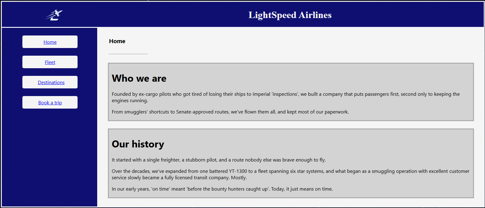
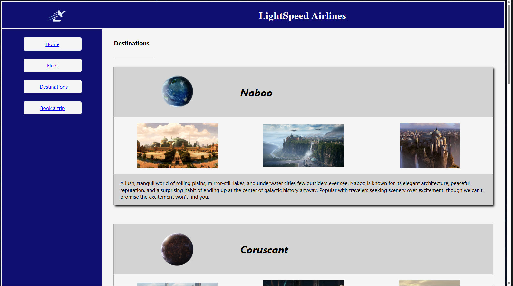
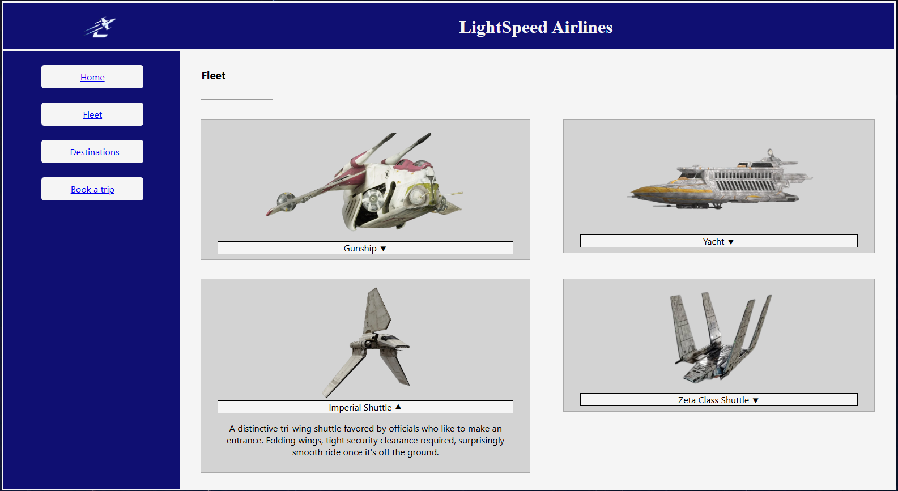
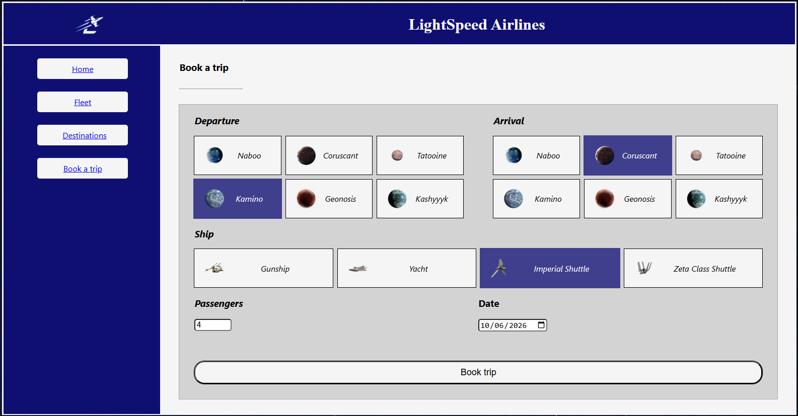
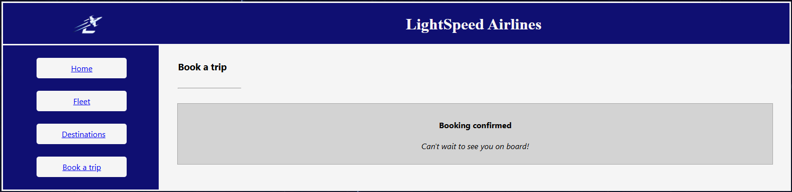

# LightSpeed Airlines

**Your next holiday is only a parsec away.** Hyperspace routes, scenic planets, and a highly reassuring amount of paperwork.

LightSpeed Airlines is a small learning project built to practise **HTML, CSS, and GitHub Actions**. It is a Star Wars-inspired travel site for passengers who would like to browse the galaxy before booking a pretend trip.

**Note:** AI was used only to generate the site captions, create the company logo, and help write this README. I wrote the website code by hand; learning by building it myself is the point of this project.

## Passenger guide

- **Home:** Meet the airline and hear how one scrappy freighter became a mostly legitimate galactic carrier.
- **Destinations:** Browse six stops: Naboo, Coruscant, Tatooine, Kamino, Geonosis, and Kashyyyk. From peaceful lakes to twin-sunned sand, pack accordingly.
- **Fleet:** Check out four ships, with expandable descriptions for the Gunship, Yacht, Imperial Shuttle, and Zeta Class Shuttle. Comfort levels vary; all ships are faster than a landspeeder.
- **Book a trip:** Choose departure and arrival planets, a ship, a travel date, and 1-10 passengers. The form leads to a booking confirmation screen.

**Small print from the flight deck:** This is a static front-end demo. The booking form uses the browser's built-in required-field checks and navigates to a confirmation page, but it does not contact an airline, save a reservation, charge credits, or guarantee that your ship will avoid an Imperial inspection.

## Screenshots

<table>
	<tr>
		<td align="center"><strong>Home</strong> </td>
		<td align="center"><strong>Destinations</strong> </td>
	</tr>
	<tr>
		<td align="center"><strong>Fleet</strong> </td>
		<td align="center"><strong>Book a trip</strong> </td>
	</tr>
	<tr>
		<td align="center"><strong>Booking confirmation</strong> </td>
		<td></td>
	</tr>
</table>

## Under the hood

- **HTML5** page templates in `templates/` provide the pages, navigation, destination and ship information, and booking form.
- **CSS3** in `static/css/styles.css` controls the layout and visual styling; images and logos live in `static/img/`.
- No framework, package installation, or build step is needed.

## View locally

To view the website, open `templates/home.html` in a web browser and use the navigation links to explore the pages.

## GitHub Actions

The **HTML5 Validator** workflow runs on every push:

1. Checks out the repository with `actions/checkout@v4`.
2. Runs `chabad360/htmlproofer@master` against `./templates` to check the HTML pages and their references.

That is the automated check currently configured for this project. There is no separate CSS linter, build, or browser end-to-end test in the workflow yet; even the Millennium Falcon needs a checklist before launch.
